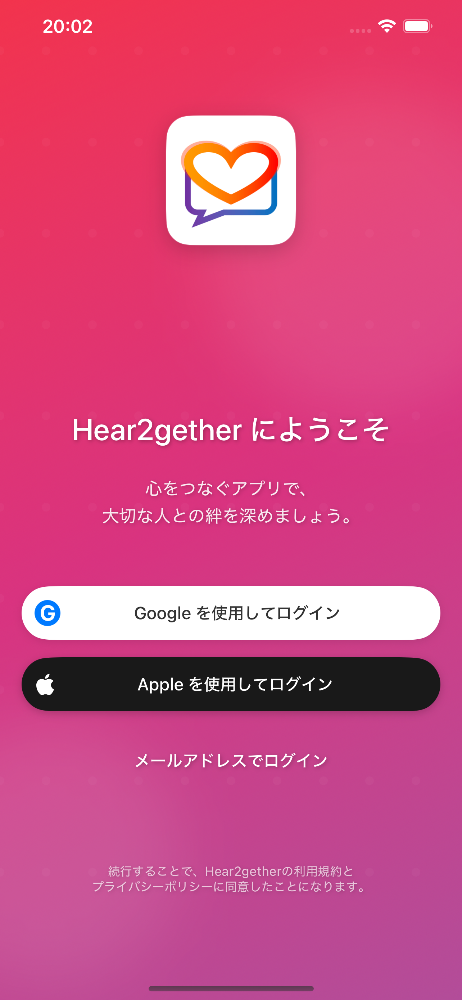
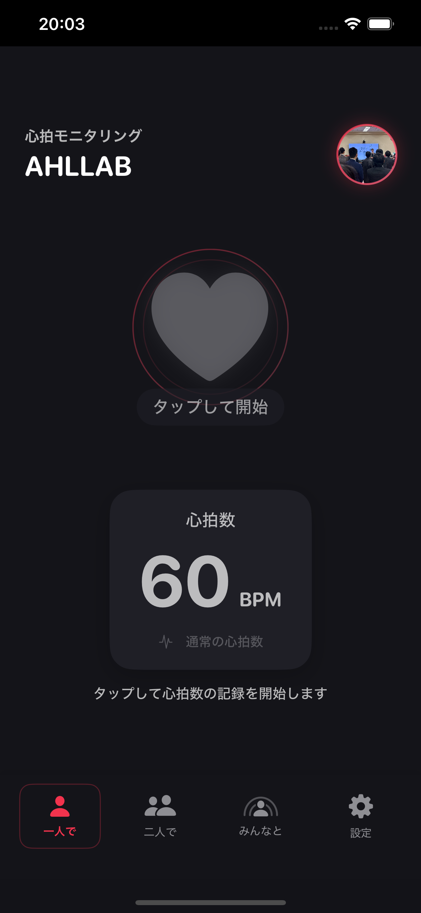
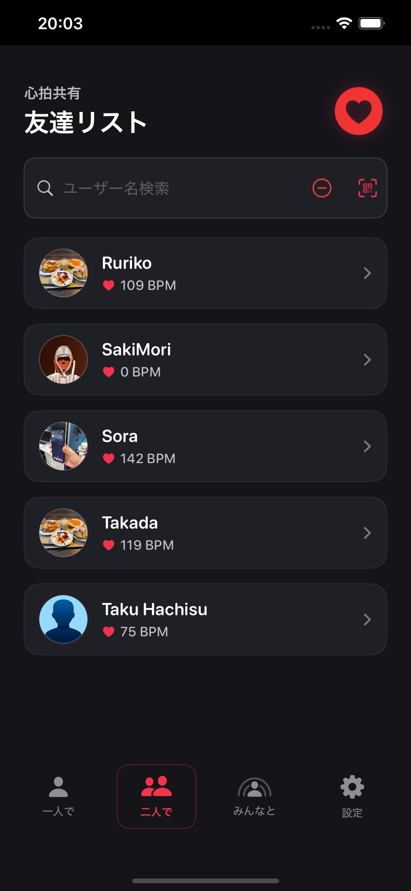
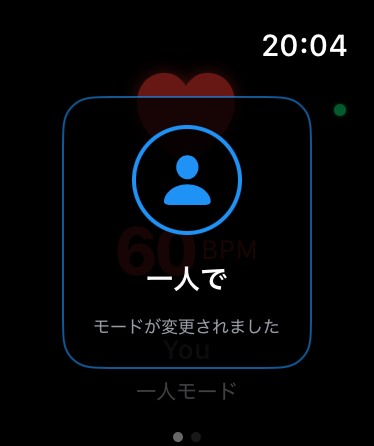
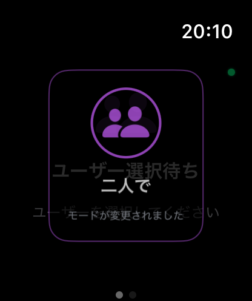
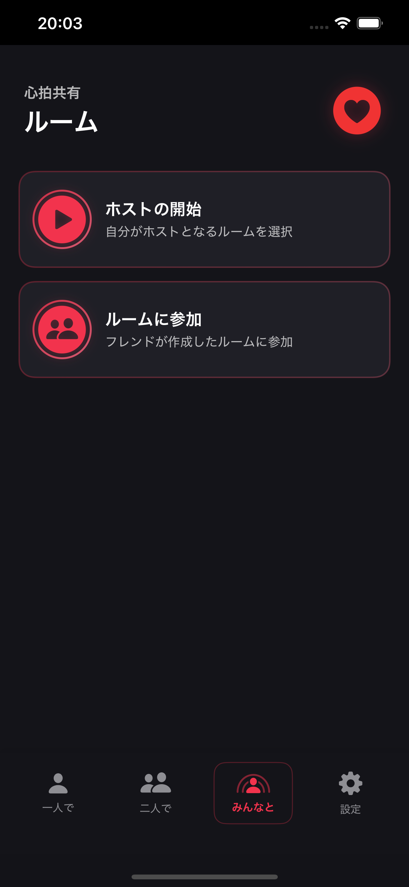
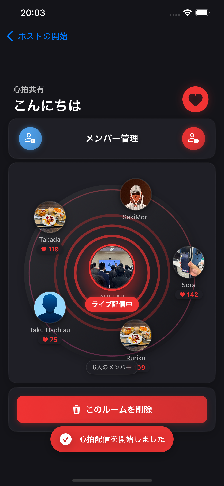
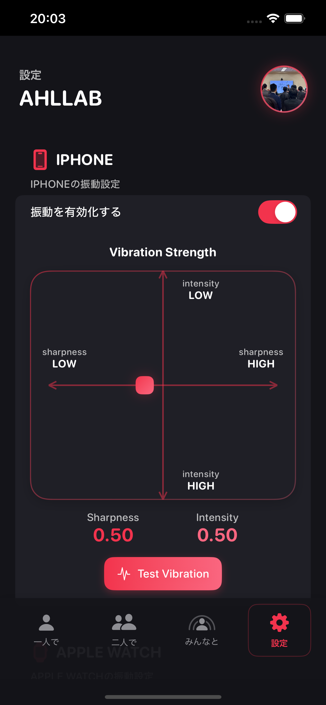
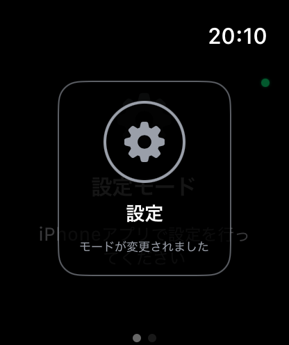
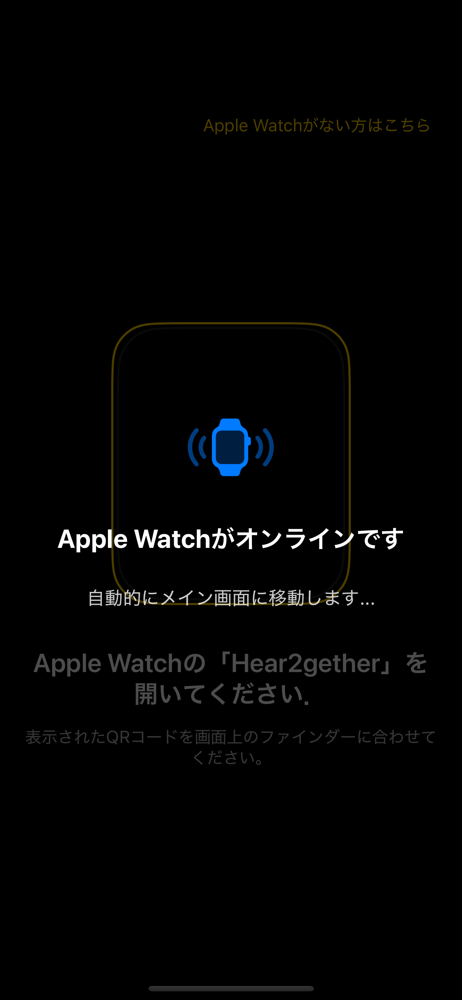

# Hear2gether

iPhoneとApple Watchユーザーをつなぎ、リアルタイムで心拍数データを共有し、協力的なゲームをプレイできる革新的な心拍数同期・ソーシャルゲーミングアプリです。触覚フィードバックを通じてお互いの心拍を感じ、心拍数ベースのマルチプレイヤー体験に参加できます。

## 📸 スクリーンショット

  
  
  

  
  
  

## ✨ 機能

### 🫀 心拍数共有モード
- **一人で（ソロモード）**: リアルタイム表示とアニメーションで自分の心拍数を監視
- **二人で（パートナーモード）**: 友達と心拍数を共有し、振動を通じてお互いの心拍を感じる
- **みんなと（グループモード）**: ホストが複数の視聴者に心拍数を配信するグループに参加
- **設定（設定モード）**: 振動パターン、設定、アプリの環境設定をカスタマイズ

  
  

### 📱 リアルタイム心拍数モニタリング
- Apple Watch HealthKit統合による継続的な心拍数追跡
- iPhoneとApple Watch間のリアルタイム同期
- 3秒ごとにFirebaseに心拍数データをアップロード
- 実際の心拍数に同期して脈動する視覚的心拍アニメーション

### 🎮 触覚フィードバックシステム
- 自然な心拍を模倣するカスタマイズ可能な振動パターン（「ドッ-クン」パターン）
- 3段階の強度レベル（弱・中・強）
- 心拍数に応答する振動タイミング
- モード固有の振動動作

  
  

### 🎯 マルチプレイヤーゲーム
- **テトリス**: 心拍数ベースの競技テトリスとリアルタイムゲームプレイ
- **心拍数表示**: 純粋な心拍数共有体験
- **カードゲーム**（開発中）
- **ディスクゲーム**（開発中）

### ⌚ Apple Watch統合
- 完全なUIを持つ専用Watchアプリ
- iPhoneとWatch間のリアルタイム接続
- Watch固有の心拍数監視と振動
- オフライン検出とWatch非使用時の「ビューアーモード」

  

## 🛠 使用技術

### コア技術
- **SwiftUI**: iOS・watchOS両対応のモダンな宣言的UIフレームワーク
- **Firebase**: 以下を含むバックエンドインフラストラクチャ：
  - Firebase Realtime Database（リアルタイムデータ同期）  
  - Firebase Authentication（Google サインイン、Apple サインイン、メール認証）
  - Firebase Storage（ユーザーデータ保存）
- **HealthKit**: Apple Watch心拍数監視とヘルスデータアクセス
- **WatchConnectivity**: iPhoneとApple Watch間のリアルタイム通信
- **Combine**: データフロー管理のためのリアクティブプログラミング

### サポート技術
- **Kingfisher**: 効率的な画像読み込みとキャッシング
- **SpriteKit**: テトリス実装用ゲームエンジン
- **Core Haptics**: 高度な触覚フィードバックパターン
- **UserNotifications**: プッシュ通知サポート
- **AVFoundation**: ゲーム音声サポート

## 📱 アプリ構造

### iPhoneアプリ
- **ModeSelectionView**: モード選択用メインタブベースインターフェース
- **OnePersonHeartRateView**: ソロ心拍数監視
- **UserSelectionView**: パートナーモード用友達選択
- **GameSelectionView**: マルチプレイヤーゲーム選択インターフェース
- **TetrisView**: フル機能マルチプレイヤーテトリスゲーム
- **HeartRateOnlyView**: 純粋な心拍数共有体験
- **AppleWatchConnectionView**: Watch ペアリングとセットアップ

### Apple Watchアプリ
- **MainView**: プライマリWatch インターフェース
- **HeartBeatView**: アニメーション付きリアルタイム心拍数表示
- **VibrationManager**: 触覚フィードバック管理
- **HealthKitManager**: 心拍数データ収集
- **FirebaseService**: クラウドデータ同期

## 🚀 主要機能

### リアルタイム同期
- デバイス間でのサブ秒レベルの心拍数更新
- Firebase による リアルタイムマルチプレイヤーゲーミング
- 自動再接続と状態管理

### ソーシャルゲーミング
- 心拍数がゲーム速度に影響する**競技テトリス**
- **リアルタイム対戦相手フィールド表示**
- **スコア追跡と勝利カウンター**
- ライン消去に基づく**お邪魔ブロック攻撃**

### アクセシビリティ機能
- Apple Watch未使用ユーザー向け**ビューアーモード**
- システム更新用**メンテナンスモード**
- 自動フォールバック付き**接続状態監視**
- テスト用UID表示付き**シミュレーターサポート**

### 高度な心拍数機能
- パートナー間での**心拍数差計算**
- **リード プレイヤー表示**
- **非アクティブユーザー検出**と適切なUI応答
- タイムスタンプ付き**履歴データ追跡**

## 📋 動作要件

- iOS 14.0+
- watchOS 7.0+
- Xcode 12.0+
- Apple Watch（フル機能利用には必須）
- Firebase アカウントと設定

## 🔧 セットアップ

1. リポジトリをクローン
2. Swift Package Manager で依存関係をインストール
3. Firebase を設定：
   - iOSアプリに `GoogleService-Info.plist` を追加
   - Authentication、Realtime Database、Storage を有効化
4. Apple Watchアプリのプロビジョニングを設定
5. iPhoneとApple Watch でビルド・実行

## 🎮 使い方

1. **ソロモード**: アプリを開いて心拍数をリアルタイムで確認
2. **パートナーモード**: 友達を選択して振動で相手の心拍を感じる
3. **グループモード**: グループに参加または作成して複数人と心拍数を共有
4. **ゲーム**: 友達と心拍数ベースのテトリス対戦に挑戦

## 🏗 アーキテクチャ

このアプリは以下の洗練されたリアルタイムマルチプレイヤーアーキテクチャを実装：
- **デュアルプラットフォーム同期**（iOS + watchOS）
- 競合解決機能付き**リアルタイムデータベース管理**
- 複数デバイス・ユーザー間での**状態管理**
- **堅牢なエラーハンドリング**と接続監視
- 拡張性を考慮した**モジュラーゲームエンジン**設計

## 👨‍💻 作成者

**高田 颯太 (Sohta Takada)**  
Email: takada[at]ah.iit.tsukuba.ac.jp

## 📄 ライセンス

このプロジェクトは MIT License の下でライセンスされています - 詳細は [LICENSE](LICENSE) ファイルをご覧ください。

## 🤝 貢献

貢献を歓迎します！お気軽にPull Requestをお送りください。